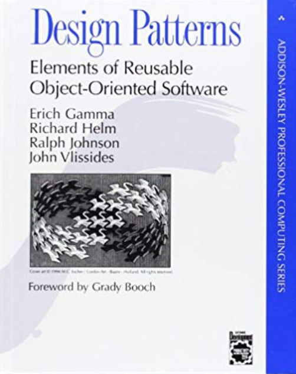
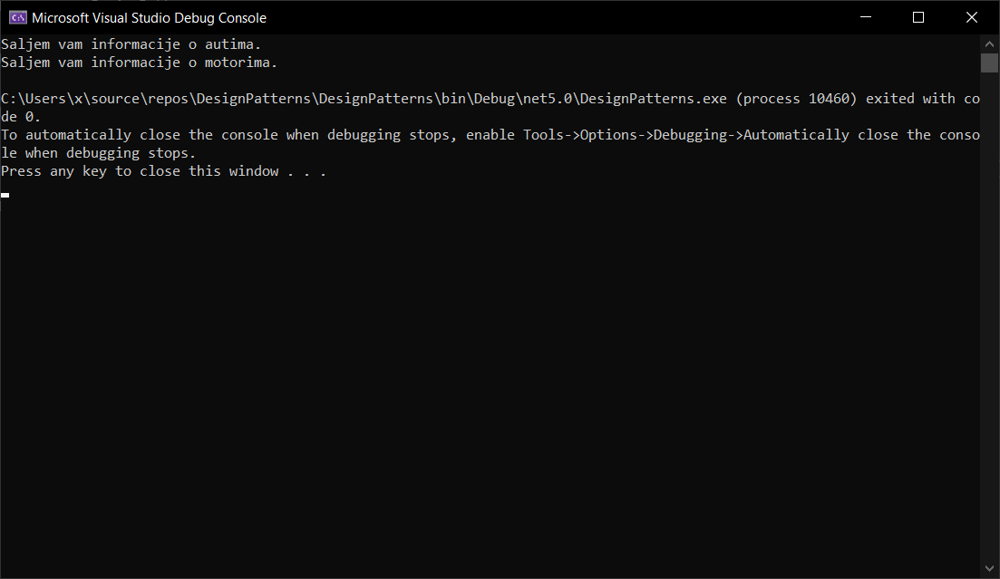

 <span style="color:#a00000;font-size:24pt">FTN Čačak</span>

### Softversko inženjerstvo 2021/2022.
___

## Design Patterns in C# – Creational Patterns

### Dejan Blagojević 222/2019
### Aleksa Spajić 213/2015

______

### Uvod

#### C# je objektno-orijentisani programski jezik opšte namene. Razvijen je 2000. godine, od strane Microsoft-a. Na čelu tima koji se bavio razvojem C#-a bio je Anders Hejlsberg.

#### Januara 1999. godine, Anders Hejlsberg osnovao je tim za izradu novog programskog jezika koji se u početku zvao COOL (C-like Object Oriented Language), idejno zamišljen kao jezik C, ali objektno orijentisan.

#### Microsoft je hteo da sačuva prvobitno ime, ali je zbog zaštitnog znaka odustao. U julu 2000. godine, okruženje .NET predstavljeno je na Konferenciji profesionalnih programera (Professional Developers Conference), jezik je preimenovan u C#, a biblioteke i ASP.NET prenesene u C#.

#### C# predstavlja naslednika C i C++ jezika, dobio je ime šarp, inspirisano muzičkom notacijom i znači da se napisana nota izvodi za pola koraka više. Fajlovi pisani u ovom jeziku imaju ekstenziju `.cs`.

#### Hejlsberg je glavni dizajner C#-a u Microsoft-u, a ranije je radio i na dizajnu Turbo Pascal-a, Delphi-a i Visual J++. U mnogim intervjuima i tehničkim dokumentima on je naveo da su upravo nedostaci drugih programskih jezika doveli do stvaranja C#.

#### C# se danas koristi širom sveta za razvijanje raznih tipova programa i aplikacija.

#### Iako je izuzetno prilagodljiv jezik, postoje tri oblasti u kojima se obično primenjuje:

##### 1. Razvijanje web aplikacija - Možemo razvijati dinamičke web-sajtove i web-aplikacije koristeći .NET platformu ili neke od drugih platformi otvorenog koda (open-source)

##### 2. Razvijanje Windows aplikacija - Programeri mogu da računaju na podršku zajednice i dokumentaciju za razvoj aplikacija i programa koji su specifični za arhitekturu Microsoft platforme.

##### 3. Razvijanje video igara - Veliki broj game engine-a koji se koriste za razvoj video igara podržava C#. Jedan od njih je i Unity, jedan od najpopularnijih game engine-a uopšte.

<p align="center">
  
</p>

______

### Design Patterns
#### U svetu razvoja softvera često se suočavamo sa istim problemima iznova i iznova. Takođe, nije neuobičajeno da se ovi problemi pojave kada je kod već završen. Ovo se može izbeći jednostavnom upotrebom Design pattern-a (obrazaca).

#### 'Gang of Four' design pattern-i je kolekcija od 23 dizajn obrasca iz knjige "Design Patterns: Elements of Reusable Object-Oriented Software".
#### Ova knjiga je prvi put objavljena 1994. godine i jedna je od najpopularnijih knjiga za učenje design pattern-a. Autori knjige su Erich Gamma, Richard Helm, Ralph Johnson i John Vlissides. Knjiga je dobila nadimak 'Gang of Four Design Patterns' zbog četiri autora. Štaviše, dobili su još kraće ime kao 'GoF Design Patterns'.


<p align="center">
  
</p>

#### Dizajn obrasci predstavljaju rešenje visokog kvaliteta za višekratnu upotrebu za dati zahtev, zadatak ili problem koji se ponavlja.

#### Obrasci se odnose na dizajn i interakciju objekata, kao i na obezbedjivanje komunikacijske platforme koja se tiče elegantnih rešenja koja se mogu ponovo koristiti za uobičajene izazove programiranja.

#### Ako ste usred projekta i razmišljate u sebi, kako niko nikada nije prošao kroz ovo ranije - velike su šanse da neko zapravo jeste.

#### Dizajn obrasci su dokumentovana verzija svih tih stvari. Razlog zašto je ovo toliko dragoceno je zato što čini aplikaciju irelevantnom, a informacije su prenosive.

#### Dizajn obrasci imaju 2 glavne prednosti:

#### 1. Pružaju nam način da rešimo probleme u vezi sa razvojem softvera koristeći proverena rešenja

##### - Koristeći proverena rešenja ne moramo da problem rešavamo samostalno, kreirajući naše sopstveno rešenje, čime utičemo na uštedu vremena.

#### 2. Dizajn obrasci čine komunikaciju između dizajnera efikasnijom

##### - Poznajući dizajn obrasce činimo komunikaciju tokom izrade projekta dosta efikasnijom, jer svi poznaju ideje korišćene za specifične dizajn obrasce, nasuprot idejama rešenja problema koje smo samostalno kreirali.

#### Dizajn obrasci se dele u 3 grupe:

##### 1. Creational patterns (kreacioni)

##### 2. Structural patterns (strukturalni)

##### 3. Behavioral patterns (bihevioralni)


______

### Creational Patterns

#### Kreacioni dizajn obrasci se bave mehanizmima kreiranja objekata. Fokus je na tome kako se objekti kreiraju i koriste u aplikaciji.

#### Kreacioni pattern-i se sastoje od dve dominantne ideje. Jedna je enkapsulacija znanja o tome koje konkretne klase sistem koristi, a druga predstavlja skrivanje toga kako se instance ovih konkretnih klasa kreiraju i kombinuju.

#### Kreacioni pattern-i su dalje kategorisani u pattern-e za kreiranje objekata i pattern-e za kreiranje klasa, gde se pattern-i za kreiranje objekata bave kreiranjem objekata, a pattern-i za kreiranje klasa bave instanciranjem klase.

#### Detaljnije, pattern-i za kreiranje objekata odlažu deo kreiranja svog objekta na drugi objekat, dok pattern-i za kreiranje klasa odlažu kreiranje svog objekta na podklase.

#### Kreacioni pattern-i se dele u pet kategorija

##### 1. Factory Method - Kreira instancu nekoliko izvedenih klasa

##### 2. Abstract Factory - Kreira instancu nekoliko porodica klasa

##### 3. Builder - Odvaja konstrukciju objekta od njegovog predstavljanja

##### 4. Prototype - Potpuno inicijalizovana instanca za kopiranje ili kloniranje

##### 5. Singleton - Klasa kod koje može postojati samo jedna instanca

______

### Factory Method

#### Factory Method je kreacioni dizajn pattern koji rešava problem kreiranja objekata bez specificiranja njihovih konkretnih klasa.

#### Factory Method definiše metodu koja treba da se koristi za kreiranje objekata umesto direktnog poziva konstruktora (`new` operator). Podklase mogu zameniti ovaj metod da bi promenile klasu objekata koji će biti kreirani.

#### KORIŠĆENJE: Factory Method pattern se veoma često koristi u C# kodu. Veoma je koristan u slučajevima kada je potrebno obezbediti visok nivo fleksibilnosti našeg koda.

#### PREPOZNAVANJE: Factory Method se može prepoznati po metodama kreiranja koje konstruišu objekte iz konkretnih klasa. Dok se konkretne klase koriste tokom kreiranja objekata, tip vraćanja factory metoda se obično deklariše ili kao apstraktna klasa ili kao interfejs.

### Primer:

##### Factory.cs:
```
abstract class Factory
	{
		public abstract IVehicle GetVehicle();
	}
```

##### FactoryForCar.cs:
```
class FactoryForCar : Factory
    {
        public override IVehicle GetVehicle()
        {
            return new Car();
        }
    }
```

##### FactoryForBike.cs:
```
class FactoryForBike : Factory
    {
        public override IVehicle GetVehicle()
        {
            return new Bike();
        }
    }
```

##### IVehicle.cs:
```
interface IVehicle
    {
        void GetDetails();
    }
```

##### Car.cs:
```
class Car : IVehicle
    {
        public void GetDetails()
        {
            Console.WriteLine("Saljem vam informacije o autima.");
        }
    }
```

##### Bike.cs:
```
class Bike : IVehicle
    {
        public void GetDetails()
        {
            Console.WriteLine("Saljem vam informacije o motorima.");
        }
    }
```

##### Program.cs:
```
class Program
    {
        static void Main(string[] args)
        {
            Factory[] objFactories = new Factory[2];
            objFactories[0] = new FactoryForCar();
            objFactories[1] = new FactoryForBike();
            foreach (Factory objFactory in objFactories)
            {
                IVehicle objProduct = objFactory.GetVehicle();
                objProduct.GetDetails();
            }
        }
    }
```

### OUTPUT:

<p align="center">
  
</p>

#### NAPOMENA: Klase `FactoryForCar.cs` i `FactoryForBike.cs` se koriste za implementaciju Factory metode, dok se klasa `Factory.cs` koristi za deklaraciju.
______

### Abstract Factory

#### Abstract Factory je kreacioni dizajn pattern, koji rešava problem stvaranja čitavih familija proizvoda bez specificiranja njihovih konkretnih klasa.

#### Abstract Factory definiše interfejs za kreiranje svih različitih proizvoda, ali prepušta stvarno kreiranje proizvoda konkretnim fabričkim klasama. Svaki tip fabrike odgovara odredjenoj vrsti proizvoda.

#### Klijentski kod poziva metode kreiranja fabričkog objekta umesto da kreira proizvode direktno pozivom konstruktora (`new` operator). Pošto fabrika odgovara jednoj varijanti proizvoda, svi njeni proizvodi biće kompatibilni.

#### Klijentski kod radi sa fabrikama i proizvodima samo preko njihovih apstraktnih interfejsa. Ovo omogućava klijentskom kodu da radi sa bilo kojim varijantama proizvoda, kreiranim od strane objekta fabrike.

#### KORIŠĆENJE: Mnoge biblioteke i veliki broj framework-a koriste ovaj pattern za obezbeđivanje načina za proširenje i prilagođavanje svojih standardnih komponenti.

#### IDENTIFIKACIJA: Abstract Factory pattern je lako prepoznati po metodama koje vraćaju fabrički objekat. Zatim se fabrika koristi za kreiranje specifičnih podkomponenti.

### Primer:

##### IFurniture.cs:

```
interface IFurniture
    {
        void FurnitureFunction();
        void ShowStyle();
    }
```


##### IFurnitureFactory.cs:

```
interface IFurnitureFactory
    {
        IFurniture CreateCabinet();
        IFurniture CreateChair();
    }
```

##### ClassicFurnitureFactory.cs:

```
class ClassicFurnitureFactory : IFurnitureFactory
    {
        public IFurniture CreateCabinet()
        {
            return new ClassicCabinet();
        }
        public IFurniture CreateChair()
        {
            return new ClassicChair();
        }
    }
```

##### SerbianFurnitureFactory.cs:

```
class SerbianFurnitureFactory : IFurnitureFactory
    {
        public IFurniture CreateCabinet()
        {
            return new SerbianCabinet();
        }
        public IFurniture CreateChair()
        {
            return new SerbianChair();
        }
    }
```

##### ClassicCabinet.cs:

```
class ClassicCabinet : IFurniture
    {
        public void FurnitureFunction()
        {
            Console.WriteLine("I'm used for storing items.");
        }

        public void ShowStyle()
        {
            Console.WriteLine("I'm classic cabinet.");
        }
    }
```

##### ClassicChair.cs:

```
class ClassicChair : IFurniture
    {
        public void FurnitureFunction()
        {
            Console.WriteLine("I'm used for sitting.");
        }

        public void ShowStyle()
        {
            Console.WriteLine("I'm classic chair.");
        }
    }
```

##### SerbianCabinet.cs:

```
class SerbianCabinet : IFurniture
    {
        public void FurnitureFunction()
        {
            Console.WriteLine("I'm used for storing items.");
        }

        public void ShowStyle()
        {
            Console.WriteLine("I'm serbian cabinet.");
        }
    }
```

##### SerbianChair.cs:

```
class SerbianChair : IFurniture
    {
        public void FurnitureFunction()
        {
            Console.WriteLine("I'm used for sitting.");
        }

        public void ShowStyle()
        {
            Console.WriteLine("I'm serbian chair.");
        }
    }
```

##### Program.cs:

```
class Program
    {
        static void Main(string[] args)
        {
            IFurnitureFactory serbianFactory = new SerbianFurnitureFactory();
            IFurnitureFactory classicFactory = new ClassicFurnitureFactory();

            IFurniture serbianChair = serbianFactory.CreateChair();
            IFurniture serbianCabinet = serbianFactory.CreateCabinet();

            IFurniture classicChair = classicFactory.CreateChair();
            IFurniture classicCabinet = classicFactory.CreateCabinet();

            serbianChair.FurnitureFunction();
            serbianChair.ShowStyle();

            serbianCabinet.FurnitureFunction();
            serbianCabinet.ShowStyle();

            classicChair.FurnitureFunction();
            classicChair.ShowStyle();

            classicCabinet.FurnitureFunction();
            classicCabinet.ShowStyle();

        }
    }
```


### OUTPUT:

<p align="center">
  
</p>

______

### Builder

#### Builder je kreacioni dizajn pattern koji omogućava izgradnju složenih objekata korak po korak.
#### Za razliku od ostalih kreacionih patterna, Builde ne zahteva da proizvodi imaju zajednički interfejs, što omogućava proizvodnju različitih proizvoda koristeći isti proces izgradnje.

#### KORIŠĆENJE: Builder dizajn pattern je naročito koristan kada treba da kreiramo objekat sa puno mogućih opcija konfiguracije.

#### IDENTIFIKACIJA: Builder dizajn pattern se može prepoznati u klasi koja ima jedan metod kreiranja i nekoliko metoda za konfigurisanje rezultujućeg objekta. Metode Builder-a često podržavaju nadovezivanje (chaining) - someBuilder.setValueA(1).setValueB(2).create().

### Primer:

##### IToyBuilder.cs:

```
interface IToyBuilder
    {
        void SetModel();
        void SetHead();
        void SetLimbs();
        void SetBody();
        void SetLegs();
        Toy GetToy();
    }
```

##### Toy.cs:

```
class Toy
    {
        public string Model
        {
            get;
            set;
        }
        public string Head
        {
            get;
            set;
        }
        public string Limbs
        {
            get;
            set;
        }
        public string Body
        {
            get;
            set;
        }
        public string Legs
        {
            get;
            set;
        }
    }
```

##### ToyABuilder.cs:

```
class ToyABuilder : IToyBuilder
    {
        Toy toy = new Toy();
        public void SetModel()
        {
            toy.Model = "TOY A";
        }
        public void SetHead()
        {
            toy.Head = "1";
        }
        public void SetLimbs()
        {
            toy.Limbs = "4";
        }
        public void SetBody()
        {
            toy.Body = "Plastic";
        }
        public void SetLegs()
        {
            toy.Legs = "2";
        }
        public Toy GetToy()
        {
            return toy;
        }
    }
```

##### ToyBBuilder.cs:

```
class ToyBBuilder : IToyBuilder
    {
        Toy toy = new Toy();
        public void SetModel()
        {
            toy.Model = "TOY B";
        }
        public void SetHead()
        {
            toy.Head = "1";
        }
        public void SetLimbs()
        {
            toy.Limbs = "4";
        }
        public void SetBody()
        {
            toy.Body = "Steel";
        }
        public void SetLegs()
        {
            toy.Legs = "4";
        }
        public Toy GetToy()
        {
            return toy;
        }
    }
```

##### ToyCreator.cs:

```
class ToyCreator
    {
        private IToyBuilder _toyBuilder;
        public ToyCreator(IToyBuilder toyBuilder)
        {
            _toyBuilder = toyBuilder;
        }
        public void CreateToy()
        {
            _toyBuilder.SetModel();
            _toyBuilder.SetHead();
            _toyBuilder.SetLimbs();
            _toyBuilder.SetBody();
            _toyBuilder.SetLegs();
        }
        public Toy GetToy()
        {
            return _toyBuilder.GetToy();
        }
    }
```

##### Program.cs:

```
class Program
    {
        static void Main(string[] args)
        {
            var toyACreator = new ToyCreator(new ToyABuilder());
            var toyBCreator = new ToyCreator(new ToyBBuilder());

            toyACreator.CreateToy();
            var ToyA = toyACreator.GetToy();

            toyBCreator.CreateToy();
            var ToyB = toyBCreator.GetToy();

            Console.WriteLine("ToyA:");
            Console.WriteLine("Model: " + ToyA.Model + "\nHead: " + ToyA.Head + "\nLimbs: " + ToyA.Limbs + "\nBody: " + ToyA.Body + "\nLegs: " + ToyA.Legs + "\n");
            Console.WriteLine("\nToyB:");
            Console.WriteLine("Model: " + ToyB.Model + "\nHead: " + ToyB.Head + "\nLimbs: " + ToyB.Limbs + "\nBody: " + ToyB.Body + "\nLegs: " + ToyB.Legs + "\n");
        }
    }
```

### OUTPUT:

<p align="center">
  
</p>

______

### Prototype

#### Prototype je kreacioni dizajn pattern koji omogućava kloniranje objekata, čak i onih složenih, bez povezivanja sa njihovim specifičnim klasama.

#### Sve klase prototipa treba da imaju zajednički interfejs koji omogućava kopiranje objekata čak i ako su njihove konkretne klase nepoznate. Prototipski objekti mogu proizvesti pune kopije jer objekti iste klase mogu pristupiti privatnim poljima jedni drugih.

#### KORIŠĆENJE: Prototype dizajn pattern je dostupan u C# sa ICloneable interfejsom.

#### IDENTIFIKACIJA: Prototip se može lako prepoznati preko metoda kloniranja (clone), kopiranja (copy), itd.

### Primer:

##### ColorPrototype.cs:

```
abstract class ColorPrototype
    {
        public abstract ColorPrototype Clone();
    }
```

##### Color.cs:

```
class Color : ColorPrototype
    {
        int red;
        int green;
        int blue;
        public Color(int red, int green, int blue)
        {
            this.red = red;
            this.green = green;
            this.blue = blue;
        }
        public override ColorPrototype Clone()
        {
            Console.WriteLine(
                "Cloning color RGB: {0,3},{1,3},{2,3}",
                red, green, blue);
            return this.MemberwiseClone() as ColorPrototype;
        }
    }
```

##### ColorManager.cs:

```
class ColorManager
    {
        private Dictionary<string, ColorPrototype> colors = new Dictionary<string, ColorPrototype>();
        public ColorPrototype this[string key]
        {
            get { return colors[key]; }
            set { colors.Add(key, value); }
        }
    }
```

##### Program.cs:

```
class Program
    {
        static void Main(string[] args)
        {
            ColorManager colormanager = new ColorManager();

            colormanager["red"] = new Color(255, 0, 0);
            colormanager["green"] = new Color(0, 255, 0);
            colormanager["blue"] = new Color(0, 0, 255);

            colormanager["angry"] = new Color(255, 54, 0);
            colormanager["peace"] = new Color(128, 211, 128);
            colormanager["flame"] = new Color(211, 34, 20);

            Color color1 = colormanager["red"].Clone() as Color;
            Color color2 = colormanager["peace"].Clone() as Color;
            Color color3 = colormanager["flame"].Clone() as Color;
        }
    }
```


______

### Singleton

#### Singleton je dizajn pattern koji osigurava da postoji samo jedan objekat te vrste i pruža mu jednu tačku pristupa za bilo koji drugi kod.

#### Singleton ima skoro iste prednosti i nedostatke kao globalne varijable. Iako su super praktični, oni narušavaju modularnost našeg koda.

#### Ne možemo samo da koristimo klasu koja zavisi od Singleton-a u nekom drugom kontekstu, bez prenošenja Singleton-a u drugi kontekst. Većinu vremena, ovo ograničenje pojavljuje se tokom kreiranja unit testova.

#### KORIŠĆENJE: Mnogi programeri smatraju da je Singleton anti-pattern. Zbog toga je njegova upotreba u padu u C# kodu.

#### IDENTIFIKACIJA: Singleton se može prepoznati pomoću statičke metode kreiranja, koja vraća isti keširani objekat.

### Primer:

##### Singleton.cs:

```
class Singleton
    {
        private int serial;
        private Singleton(int serial)
        {
            this.serial = serial;
        }

        private static Singleton _instance;

        public static Singleton GetInstance(int serial)
        {
            if (_instance == null)
            {
                _instance = new Singleton(serial);
            }
            return _instance;
        }

        public void printSerial()
        {
            Console.WriteLine(serial);
        }
    }
```

##### Program.cs:

```
class Program
    {
        static void Main(string[] args)
        {
            Singleton prvi = Singleton.GetInstance(1389);
            Singleton drugi = Singleton.GetInstance(2022);

            prvi.printSerial();
            drugi.printSerial();

        }
    }
```

### OUTPUT:

<p align="center">
  
</p>
______


### Reference

1. https://www.c-sharpcorner.com/UploadFile/nipuntomar/creational-design-pattern-for-net/

2. https://www.wikipedia.com

3. https://www.digitalocean.com/community/tutorials/gangs-of-four-gof-design-patterns

4. https://insight.averna.com/en/resources/blog/how-can-design-patterns-solve-all-your-problems

5. https://stackify.com/what-is-c-used-for/

6. https://www.dofactory.com

7. https://sourcemaking.com/design_patterns

8. https://refactoring.guru/design-patterns/csharp